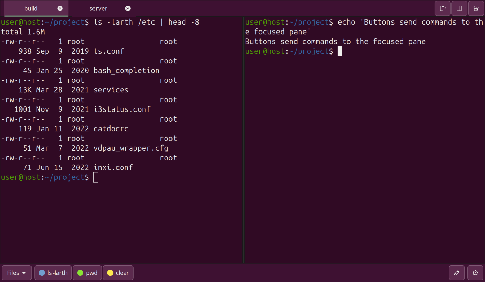

# Smart Terminal v1.0

A tabbed terminal with a **customizable button bar**, in the spirit of SecureCRT and WindTerm.
Click a button and its command (or keystroke) is sent to the terminal you are working in:
`ls -larth`, `Ctrl+C`, `Esc`, a deploy script, anything you can type.



## What it is

Smart Terminal (repository name: `terminal-buttons`) is a small GTK 3 application written in Python. It is a **wrapper around the
[VTE](https://gitlab.gnome.org/GNOME/vte) terminal widget** (`Vte.Terminal`), the same widget that
GNOME Terminal, Tilix, and many other Linux terminals use behind the scenes. The terminal
emulation itself (colors, scrollback, mouse support, shell integration) is therefore identical to
what you get in GNOME Terminal.

The app adds the things VTE does not provide on its own: tabs, split panes, search, a configurable
button bar, configurable shortcuts, and a settings dialog.

> **Why not embed GNOME Terminal itself?** `gnome-terminal-server` is a separate process that owns
> its own windows, and on Wayland one application cannot embed another application's window.
> Using the VTE widget directly is the supported way to get the same terminal inside your own window.

## Features

**Terminal**
- Tabs with a close button on each tab, drag to reorder, rename, and clone (same working directory). Double-click empty space in the tab strip to open a new tab.
- Vertical and horizontal split panes, nested as deeply as you like. Every pane created by a split gets its own small tab header with the penguin icon, the
  terminal title and a close button (the first pane is represented by the tab itself).
- A scrollbar on the right of every terminal, linked to the scrollback (20,000 lines).
- Search inside the terminal (`Ctrl+F`), with next/previous match.
- Copy on select, middle-click paste, PuTTY-style right-click (copy selection / paste), or a
  right-click context menu.
- Warning before pasting multiple lines ("Paste 18 lines into terminal?").
- Switch to a tab by hovering over it for a configurable time (default 2 seconds), like WindTerm.

**Button bar**
- Buttons sit at the bottom of the window and are organized in **groups**, chosen from a drop-down
  on the left.
- A button sends text and optionally presses Enter. It supports escape sequences, so you can send
  control keys: `\x03` (`Ctrl+C`), `\x04` (`Ctrl+D`), `\x1b` or `\e` (`Esc`), `\t` (`Tab`),
  `\n`, `\r`, `\\`.
- Each button can have a color, shown as a dot next to its label.
- Right-click a button and choose **Edit…** to change it. The button editor lets you add, delete,
  and reorder buttons, edit groups, and pick colors.
- Buttons act on the terminal that currently has focus, including the focused split pane.

**Customization**
- Four themes: Light, Dark, Blue, Aubergine (the Ubuntu terminal look).
- Five languages: English, Deutsch, Français, Türkçe, Русский.
- Every keyboard shortcut can be changed in Settings.
- Export and import all settings, including your button bars, as one JSON file.

## Requirements

- Python 3
- GTK 3, VTE 2.91 and the PyGObject bindings

On Ubuntu and Debian:

```bash
sudo apt install python3-gi gir1.2-gtk-3.0 gir1.2-vte-2.91
```

The default font is `Ubuntu Sans Mono`. If it is not installed, GTK falls back to another
monospace font.

## Installation and running

```bash
git clone https://github.com/kutyaroztas/terminal-buttons.git
cd terminal-buttons
python3 terminal_buttons.py
```

There is nothing to build. The app creates its `config/` folder on first start.

### Optional: add it to your application menu

Create `~/.local/share/applications/terminal-buttons.desktop` (adjust the paths to where you cloned
the project):

```ini
[Desktop Entry]
Type=Application
Name=Smart Terminal
Exec=python3 /path/to/terminal-buttons/terminal_buttons.py
Icon=terminal-buttons
StartupWMClass=terminal-buttons
Categories=System;TerminalEmulator;
```

Install the icon so the menu can find it:

```bash
mkdir -p ~/.local/share/icons/hicolor/scalable/apps
cp terminal-buttons.svg ~/.local/share/icons/hicolor/scalable/apps/
```

## Usage

### Tabs and panes

| Action | How |
| --- | --- |
| New tab | `+` button in the tab strip, double-click empty space in the tab strip, or `Ctrl+Shift+T` |
| Close tab | `✕` on the tab, or `Ctrl+W` |
| Next / previous tab | `Ctrl+Tab` / `Ctrl+Shift+Tab` |
| Clone tab | Double-click the tab (opens in the same working directory) |
| Rename tab | Right-click the tab, choose **Rename tab** |
| Reorder tabs | Drag a tab |
| Switch tab without clicking | Hover over the tab for the configured delay (default 2 s) |
| Split side by side | Split button in the tab strip, or `Ctrl+Shift+E` |
| Split top and bottom | Split button in the tab strip, or `Ctrl+Shift+O` |
| Close the focused pane | `Ctrl+Shift+W` (closing the last pane closes the tab) |

A pane also closes when its shell exits (for example after `exit` or `Ctrl+D`).

### Search

Press `Ctrl+F` to open the search bar under the terminal. Matches are highlighted while you type.
`Enter` goes to the next match, `Shift+Enter` to the previous one, and `Esc` closes the bar.
The search is case-insensitive unless your query contains an uppercase letter.

### Copy and paste

- `Ctrl+Shift+C` copies the selection, `Ctrl+Shift+V` pastes.
- With **Copy on select** enabled, selecting text copies it immediately.
- With **Middle-click pastes** enabled, the middle mouse button pastes the primary selection.
- **Right-click action** is either a context menu (Copy, Paste, Select all, Find, split, rename,
  close) or PuTTY style: right-click copies the selection if there is one, otherwise pastes.
- If **Warn before pasting multiple lines** is enabled, you are asked to confirm before text with
  more than one line is pasted. This applies to every way of pasting.

### The button bar

Pick a group from the drop-down at the bottom left, then click a button to send its command to the
focused terminal.

To change buttons, right-click one and choose **Edit…**, or click the pencil icon at the bottom
right. In the editor:

| Column | Meaning |
| --- | --- |
| Label | Text shown on the button |
| Command | Text to send. Supports `\xHH`, `\n`, `\t`, `\e`, `\r`, `\\` |
| Enter | If checked, Enter is pressed after the command |
| Color | Click the dot to pick a color |
| Group | Buttons with the same group name share a group in the drop-down |

Double-click a cell to edit it. Use **Add**, **Delete**, **Up**, **Down** and **Clear color** for
the rest. Changes are saved when you press **Save**.

**Group order…** (bottom right of the editor) opens a small dialog where you move groups up and
down. The first group is shown at the top of the group drop-down, and the app always starts with it
selected. Groups you never ordered are listed after the ordered ones.

Examples:

| Label | Command | Enter | Effect |
| --- | --- | --- | --- |
| `ls -larth` | `ls -larth` | yes | Runs the command |
| `Ctrl+C` | `\x03` | no | Interrupts the running program |
| `Esc` | `\x1b` | no | Sends the Escape key |
| `Password` | `hunter2` | no | Types text without pressing Enter |

> **Note:** commands are stored as plain text in `config/buttons.json`. Do not put real
> passwords or secrets in buttons.

### Settings

Click the gear icon at the bottom right.

- **General:** theme, language, right-click action, copy on select, middle-click paste, multiline
  paste warning, tab hover delay (seconds, `0` turns it off), a shortcut to the button editor, and
  **Export settings…** / **Import settings…**.
- **Shortcuts:** click a shortcut, then press the new key combination. `Esc` cancels, `Backspace`
  removes the shortcut. If the combination is already used by another action, it is taken over
  from that action. **Reset to defaults** restores the original shortcuts.

Default shortcuts:

| Action | Shortcut |
| --- | --- |
| New tab | `Ctrl+Shift+T` |
| Close tab | `Ctrl+W` |
| Next tab | `Ctrl+Tab` |
| Previous tab | `Ctrl+Shift+Tab` |
| Split vertically (side by side) | `Ctrl+Shift+E` |
| Split horizontally (stacked) | `Ctrl+Shift+O` |
| Close pane | `Ctrl+Shift+W` |
| Find | `Ctrl+F` |
| Copy | `Ctrl+Shift+C` |
| Paste | `Ctrl+Shift+V` |

Note that terminal programs also use some of these keys. `Ctrl+W`, for example, deletes the last
word in bash. While the app owns the shortcut, the terminal program does not receive it. Change
the shortcut in Settings if that gets in your way.

### Export and import

**Export settings…** writes one JSON file with all settings and all your buttons. **Import
settings…** reads such a file and replaces your current settings and buttons. Use it to back up
your setup or move it to another machine. Files that are not valid settings files are rejected
without changing anything.

## Configuration files

Everything is stored next to the program in `config/`:

| File | Content |
| --- | --- |
| `config/buttons.json` | Your buttons: label, command, enter, group, color |
| `config/settings.json` | Theme, language, mouse options, hover delay, group order, shortcuts |

Both files are plain JSON and can be edited by hand while the app is closed. They are listed in
`.gitignore`, so your personal setup is never committed by accident. If a file is missing or
broken, defaults are used.

## Compatibility

Developed and tested on **Ubuntu 24.04 LTS** (GNOME, Wayland) with Python 3.12, GTK 3.24 and
VTE 0.76.

It is expected to work on other Linux distributions and other Ubuntu versions as well, as long as
Python 3, GTK 3 and VTE 2.91 with the PyGObject bindings are available. Those other versions have
not been tested. If something does not work for you, please open an issue and include your
distribution, version and the terminal output.

## License

MIT, see [LICENSE](LICENSE).
